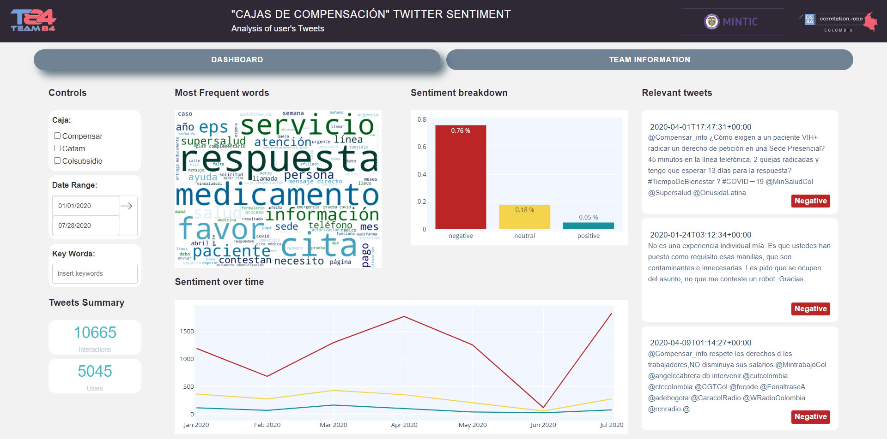

# Twitter Sentiment Analysis for SuperSociedades

Final project for DS4A program July 2020

Author : Team 84

The dashboard is accessible through: http://jaimesub.dns-cloud.net:8050/ 

## INSTALLATION

If ou want to run the model and the dash app it's as simple as : 

1/ Open terminal

2/ Run 'pip install r- requirements.txt'

3/ Run 'python -m spacy download es_core_news_lg'

4/ Run 'python app.py'

5/ Open dash app in your browser

## DASHBOARD

In DAsh APP the user can see how the sentiment classification from the tweets selected, if it changes through time and the classification of the most relevant tweets. There is a posibility to filter the base of tweets by company, date or key words.

## THE DATA

Collection of tweets where 3 major 'cajas de compensación' where mentioned from 01/01/207 to date. 
There is a preprocessing for cleaning the text before running the sentiment analysis model.
All these steps are done with the code: script_final_modelo.py

## THE MODEL

For classifying sentiment we are using the model ScentiPy found at: https://github.com/aylliote/senti-py

##### The model is a simple pipeline that includes : 

- A vectorizer : go from the text/string representation of the comment to a vectorized representation.
				This is done with a TfIdfVectorizer
- A feature Selector : The vectorizer will output a n_samples*n_features very sparse matrix (scipy sparse 					matrices are already used by the sklean algorithm). This will reduce the number n_features, 				checking weather a feature is relevant or not.
- A classifier : The model used is a Multinomial Naive Bayes, which performs really well for text 
				classification.

The parameters and hyper-parameters of this pipeline are found by the use of a GridSearch K - cross validation with K = 10

##### The model is fed data crawled from various websites : 

-Trip Advisor
-PedidosYa
-Apestan
-QuejasOnline
-MercadoLibre
-SensaCine
-OpenCine
-TASS
-Twitter

